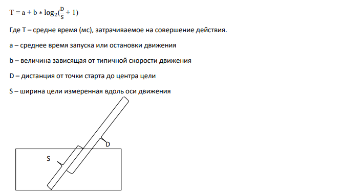

```
Разработка и программирование человеко-машинного интерфейса
```
**Метафоры**

Метафоры очень полезны в проектировании, они связывают новый продукт с его
предшественником, они делают продукт более легким в освоении или использовании они могут
помочь проектировщику в создании дизайна и выбору проектных решений, однако метафоры
могут быть опасны, пользователи могут верить в то, что новая система должна работать
идентично аналогичной системе, с которой они уже знакомы. И будут озадачены, если это
окажется не так, так же проектировщики могут слишком сильно придерживаться метафоры, что
может быть причиной плохого дизайна. Из вышесказанного можно сделать следующие выводы и
рекомендации:

1. Подыщите хорошую метафору, но не придерживайтесь ее слишком сильно, делайте
    четкое различие.
2. Попробуйте найти направление в которых дизайн может улучшить старые способы
    ведения дел.

**Законы Фитса и Хика**

**Закон Фитса**

Представим, что вы перемещаете курсор кнопки, изображенной на экране, кнопка является целью
данного перемещения, длина прямой линии, соединяющей начальную позицию курсора и
ближайшую точку целевого объекта, определяется в законе Фитса как _дистанция_. На основе
данных о размерах объекта и дистанции **закон Фитса** позволяет найти среднее время, за которое
пользователь сможет переместить курсор к кнопке.

В одномерном случае, при котором размер объекта вдоль линии перемещения курсора
обозначается как S, а дистанция от начальной позиции курсора до объекта — как D, закон Фитса
формулируется следующим образом:



вплотную прилегает к границе(стороне) экрана, а курсор манипулятора мыши останавливается у
края автоматически. Угол является еще более легкой целью, т.к. ширина цели бесконечна в обоих
измерениях.

Контекстное меню, особенно используемое в некоторых играх радиальное, сокращает расстояние
до цели. Тем самым сокращая время, затрачиваемое на совершение действия.

Закон был опубликован Полом Фитсем в 1954 году.


[< Previous](10.md) | [Next >](12.md)