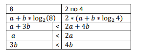

```
Разработка и программирование человеко-машинного интерфейса
```
**Hick’s law**

**Закон Хика** – экспериментально установленная зависимость времени реакции выбора от числа
альтернативных сигналов. Впервые она была получена немецким психологом Меркелем в 1885
году и позднее подтверждена и проанализирована английским психологом Хиком в 195 2 году. Эту
зависимость Хик аппроксимирует функцией следующего вида:

𝑇=𝑎+𝑏∗log 2 (𝑛+ 1 )

Где T – значение времени реакции, усредненное по всем альтернативным сигналам, a и b –
константы, n – число равновероятных альтернативных сигналов, (+ 1) – репрезентует
дополнительную альтернативу в случае пропуска сигнала.

Коэффициенты, используемые в выражении закона Хика в большой степени зависят от многих
условий включая то, как представлены возможные варианты и то насколько хорошо пользователь
знаком с системой.

При использовании любых положительных и ненулевых значений a и b из закона Хика следует,
что предоставление пользователю сразу нескольких вариантов одновременно обычно является
более эффективным, чем организация тех же вариантов в иерархические группы.



Это согласуется с данными полученными в экспериментах со структурами меню.

Можно привести также эквивалентную формулировку закона Хика:

Время реакции возрастает как линейная функция количества информации, измеренной в битах.

Этот закон носит название «Хика-Хаймана»

𝑇=𝑎+𝑏∗𝐻

Где T – время реакции, a и b – константы, H – количество информации измеряемой в битах


