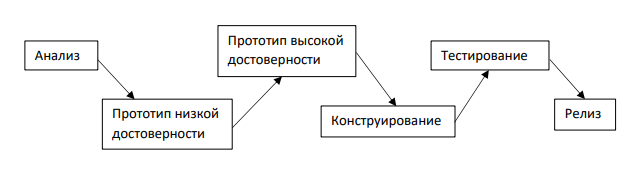
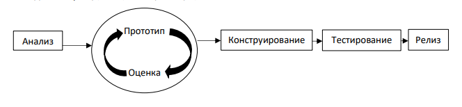

Разработка и программирование человеко-машинного интерфейса

**Достоверность**

Все прототипы можно разделить на прототипы низкой достоверности и прототипы высокой
достоверности. Прототип низкой достоверности может симулировать некоторую интерактивность,
но не отражает всех тонкостей взаимодействия, в свою очередь прототипы высокой
достоверности выглядят более похожими на готовое устройство. Окончательный, утвержденный
дизайн, пример прототипа высокой достоверности, он может иметь некоторые из функций
завершенного продукта и позволяет протестировать больше тонкостей взаимодействия.

Преимущества и недостатки прототипов разной степени достоверности:

Преимущества низкой степени:

1. Меньшая стоимость разработки
2. Возможность оценки множества вариантов дизайнов
3. Доказывает или опровергает идеи и концепции
4. Решает проблемы создания макетов экрана

Недостатки низкой степени:

1. Ограниченный контроль ошибок
2. Плохая детализация спецификаций
3. Ограниченная пригодность для юзабилити-тестирования
4. Ограничения, связанные с навигацией и потоками активности

Преимущества высокой степени:

1. Высокая достоверность
2. Почти полная функциональность
3. Интерактивность
4. Является инструментом для исследования и тестирования
5. Наглядно показывает конечный продукт
6. Служит «живой» спецификацией
7. Маркетинговый и торговый инструмент

Недостатки высокой степени:

1. Высокая стоимость разработки
2. Не эффективен для проверки идей и концепций
3. Не эффективен для формирования окончательных требований

До начала создания прототипа высокой достоверности убедитесь, что ваш дизайн хорош, создав
несколько прототипов низкой достоверности. Они могут принимать разные формы, и каждая из
них позволяет подтвердить или проверить различные аспекты дизайна.

**Прототипирование**

Под прототипированием следует понимать ничто иное, как процесс создания прототипа.

**Виды прототипирования**

Традиционный подход к разработке макета пользовательского интерфейса основан на переходе
от прототипа низкой достоверности к прототипу высокой достоверности.

На практике, эта простая и логичная схема выливается в более совершенную технологию
эволюционного прототипирования.

**Эволюционное прототипирование** предполагает последовательное увеличение достоверности
исходного образца, пока, в конце концов, он не становится законченной системой.

Эволюционное прототипирование — широко распространенный подход к разработке
интерфейсов, но он таит некоторую опасность: если изначально создается прототип высокой
достоверности, его сложно будет расширять для проверки новых идей. Несмотря на это,
эволюционное прототипирование может быть полезным для выявления все больших и больших
тонкостей в аспектах дизайна и его совершенствования.

[< Previous](7.md) | [Next >](9.md)