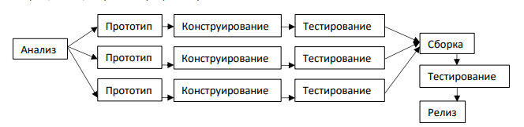
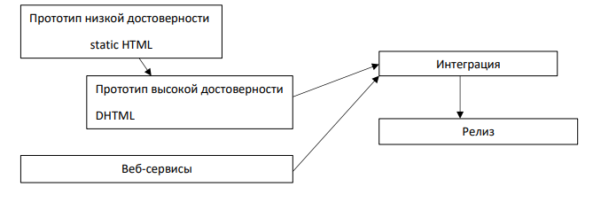

```
Разработка и программирование человеко-машинного интерфейса
```
**Быстрое прототипирование** подразумевает, что серии прототипов создаются, а затем, после их
оценки адекватности модели, отбрасываются. Обычно разрабатываются прототипы все более и
более высокой достоверности. Быстрое прототипирование может быть сложным для
проектирования командой разработчиков или для приемки менеджерами, потому что выглядит
так, как если бы время, затраченное на разработку прототипа, было потрачено в пустую.

**Инкрементное прототипирование** основано на сборке окончательного продукта из нескольких
прототипов, все части, т.е. отдельные прототипы могут разрабатываться параллельно, тем самым
сокращая общее время на разработку.



**Экстремальное прототипирование.** Используется при создании веб приложений, весь процесс
разбивается на три фазы, в первой фазе создается прототип низкой достоверности, состоящий из
статических веб страниц. Во второй фазе создается работоспособный код. А статические веб
страницы переписываются с учетом используемого фреймворка и функциональности. Создается
полностью работоспособный на уровне модели пользовательский интерфейс. В третьей фазе
выполняется интеграция веб интерфейса со всеми сервисами и рисунками.



**Бумажное прототипирование**. Этот метод позволяет смоделировать не только визуальные
аспекты веб сайта или программы, но и некоторые особенности взаимодействия с ними. Этот
метод может быть использован для разработки дизайнов небольших устройств.

Что необходимо для создания прототипа:

1. Картон, линованая и не линованая бумага, разноцветная бумага для заметок, листы
    прозрачной ацетатной пленки
2. цветные ручки, фломастеры, карандаши
3. канцелярский клей, клейкая лента
4. Ножницы, канцелярский нож, линейка, циркуль

В своей книге о проектировании веб сайтов, авторы МакКракен и Вольф предлагают в качестве
основы для прототипов всех страниц сайта использовать распечатанный на плотной бумаге


скриншот окна браузера, они же предлагают делать все, что изменяется или исчезает на сайте
(панели меню, текстовые поля, блоки и т.д.) из бумаги, в интернете есть множество шаблонов.
Окончательный результат можно отсканировать или сфотографировать. Этот прототип позволяет
моделировать интерактивность путем перемещения, удаления и размещения различных
элементов на шаблоне. МакКракен и Вольф предлагают установку крайнего срока, для
изготовления прототипа, потому что многие участники команды разработчиков постоянно будут
предлагать какие-нибудь усовершенствования в ходе работы над моделью, это творческое
усердие дизайнеров, может длиться вечно, пока у них будут идеи, которые могут быть проверены.


[< Previous](8.md) | [Next >](10.md)