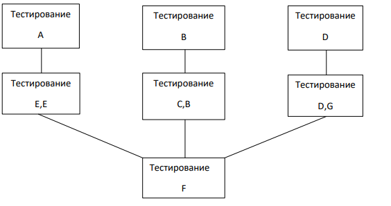

**Классификация тестов проверки по объектам тестирования на основных стадиях разработки**

1. Тестирование спецификаций
    a. Полноты и правильности функции
    b. Согласованности интерфейсов
2. Тестирование программ
    a. Структуры программ
    b. Вычисление и преобразование данных
    c. Полноты выполняемых функций
3. Тестирование комплекса
    a. Структура комплекса
    b. Интерфейса компонент
    c. Ограничение по памяти
    d. Длительности исполнения
    e. Полноты решения задач комплекса
4. Тестирование при испытаниях
    a. Соответствие требованиям
    b. Удобство установки рабочей версии
    c. Работа комплекса на оборудовании
    d. Удобство модификации и сопровождения
5. Тесты интеграционных испытаний

При этом могут возникать ошибки в случае неправильного задания переменных в операторах
вызова или при вычислениях процедур или функций. Возникающие ошибки в связях устраняются,
а затем повторно проверяется связь с компонентой F, в виде троек Компонента – Интерфейс –
Компонента

Следующим шагом тестирования системы является проверка функционирования системы с
помощью тестов проверки системы и требований к ним.

После проверки системы на функциональных функциях идет проверка системы на
исполнительных и испытательных тестах, подготовленных согласно требованиям и программному
обеспечению аппаратуре и выполняемым функциям. Испытательному тесту предшествует
верификация и валидация программного обеспечения. Тесты испытания системы в соответствии с
требованиями заказчика проявляется в реальной среде, которая в дальнейшем будет
использоваться.

**Команда тестировщиков**

За функциональные и исполнительные тесты несут ответственность разработчики, а заказчик
больше влияет на составление тестов испытаний и инсталляции системы для этих целей как
правило создается служба проверяющих программных систем в виде команды тестировщиков
которая не зависит от штата разработчиков программной системы некоторые члены этой команды
являются опытными или даже профессионалами в этой области.

С самого начала создания проекта тестировщики включают в процесс планы составления тестовых
наборов и сценариев, а также графиков выполнения тестов. Профессиональные тестировщики
работают совместно с группой управления конфигурации, чтобы обеспечить их документации и
другими механизмами для связи между собой тестов с требованиями проекта, конфигураций и
кодом. Они разрабатывают методы и процедуры тестирования.

Аналитиков включают в качестве членов команды так как они понимают проблемы определения
спецификации заказчиков. Проектировщики системы сообщают команде тестировщиков
проектные цели чтобы они знали декомпозицию системы на подсистемы и функции, а также
принципы их работы. После проектирования тестов и тестовых покрытий команда тестировщиков
подключает проектантов для возможности анализа системы. Встречаемые ошибки в программе и
изменения в системе отражается в документации, требованиях, проекте, а также в описаниях
входных и выходных данных.

Специалисты по управлению конфигурацией учитывают эти изменения и координируются в
составлении тестов. В команду тестировщиков входят так же пользователи, они оценивают
получаемые результаты, удобство использования, а так же высказывают свое мнение о принципах
работы системы уполномоченные заказчика планируют работы для тех кто будет использовать и
сопровождать систему при этом они могут привнести некоторые изменения в проект из-за
неполноты заданных требований и сформулировать системные требования для проведения
верификации системы и принятия решений о ее готовности и полезности

